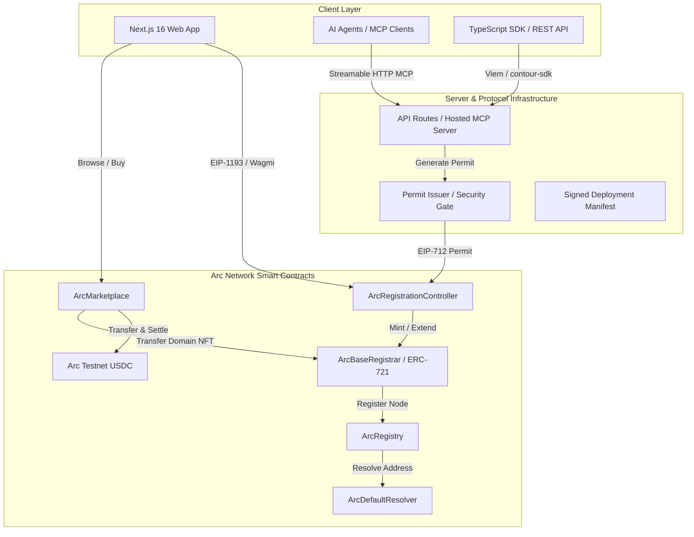

# 🌐 Contour Name Protocol (`.contour`)

[-6366f1?style=for-the-badge)](https://testnet.arcscan.app)
[](https://testnet.arcscan.app)
[](https://modelcontextprotocol.io)
[](https://nextjs.org)
[](https://getfoundry.sh)
[](LICENSE)

**Contour** is a high-performance, modular, and AI-agent-native decentralized name service infrastructure built on **Arc Network**. It powers the `.contour` namespace with native **USDC settlement**, an **on-chain domain marketplace**, **forward/reverse resolution**, **TypeScript SDK**, and **hosted Model Context Protocol (MCP)** server for autonomous on-chain agents.

---

## 🚀 Live Protocol Links & Endpoints

| Resource | Link / Endpoint | Description |
| :--- | :--- | :--- |
| 🌐 **Live Web Application** | [contour-arc.vercel.app](https://contour-arc.vercel.app) | Complete Web3 App (Search, Register, Manage, Market) |
| ⛓️ **Arc Testnet RPC** | `https://rpc.testnet.arc.network` | Chain ID: `5042002` (`eip155:5042002`) |
| 🔍 **Block Explorer** | [testnet.arcscan.app](https://testnet.arcscan.app) | Contract verification & transaction explorer |
| 🤖 **Hosted MCP Server** | `https://contour-arc.vercel.app/api/mcp` | Streamable HTTP endpoint for AI Agents |
| 📄 **OpenAPI Specification** | `https://contour-arc.vercel.app/api/openapi.json` | OpenAPI 3.1 REST API specification |
| 🧠 **Agent Index (`llms.txt`)** | `https://contour-arc.vercel.app/llms.txt` | Machine-readable integration guide for LLMs |
| 📦 **Signed Manifest** | `https://contour-arc.vercel.app/deployment-manifest.json` | Verifiable deployment proof and contract addresses |
| 🩺 **Live Health Status** | `https://contour-arc.vercel.app/status` | Real-time RPC and protocol readiness telemetry |

---

## 🌟 Key Features

### 1. 🏷️ Native `.contour` Name Service
- **ENSIP-15 Normalized:** Complete client and server label normalization and validation.
- **USDC Settlement:** Transparent on-chain pricing settled directly in native Arc USDC.
- **Forward & Reverse Resolution:** Map `.contour` names to EVM addresses (`0x...`) and reverse-resolve addresses back to primary verified names.
- **Direct & Secure Registration:** Server-issued, time-bounded EIP-712 permits prevent front-running and protect mint integrity while maintaining non-custodial user control.

### 2. 🏪 On-Chain Domain Marketplace
- **Non-Custodial Escrow & Direct Sales:** List names for sale in USDC, update prices, or cancel listings anytime.
- **Instant Buy & Atomic Settlement:** Single-transaction purchase transferring ownership and routing proceeds/protocol fees securely.
- **Marketplace Invalidation:** Automatic protection preventing stale listings when names change ownership externally.

### 3. 🤖 AI Agent First (MCP Server & Tooling)
- **Hosted Model Context Protocol (MCP):** Connect Claude Desktop, Cursor, Windsurf, LangChain, or custom autonomous agents directly without local dependencies.
- **Agent Action Plans:** Unsigned transaction planners for registration, renewals, transfers, marketplace listings, and USDC approvals.
- **Autonomous Resolution:** Allows AI agents on Arc to verify recipient identities and interact with human-readable addresses.

### 4. 🛠️ Developer Ecosystem & Public SDK
- **`contour-sdk`:** Lightweight, production-grade TypeScript client with Viem integration.
- **Machine-Readable Metadata:** Companion routes for dynamic SVG badge generation (`/api/image/{tokenId}`) and ERC-721 compatible NFT metadata (`/api/metadata/{tokenId}`).
- **OpenAPI 3.1 Documentation:** Standardized REST endpoints for high-throughput querying.

### 5. 🛡️ Non-Custodial Governance & Administration
- **Role-Based Access Control:** Governance controls with 2-step ownership transfer, emergency pause switches, and secure treasury management.
- **Verifiable Deployment Manifests:** Cryptographically signed deployment and promotion passes guaranteeing contract provenance.

---

## 🏛️ System Architecture



---

## 💰 Pricing Structure

Annual registration and renewal fees on Arc Testnet:

| Label Length | Annual Price | Description |
| :--- | :---: | :--- |
| **4+ Characters** | `0.50 USDC` | Standard names (`alice.contour`, `cyberpunk.contour`) |
| **3 Characters** | `1.00 USDC` | Premium short names (`arc.contour`, `eth.contour`) |
| **2 Characters** | `2.50 USDC` | Ultra-rare names (`ai.contour`, `zk.contour`) |
| **1 Character** | `5.00 USDC` | Genesis single-letter names (`a.contour`, `x.contour`) |

---

## 💻 Developer Quickstart

### Installation

```bash
# Install contour-sdk with viem
npm install contour-sdk viem
# or with pnpm
pnpm add contour-sdk viem
```

### Forward & Reverse Resolution Example

```typescript
import { createPublicClient, http } from "viem";
import { ARC_TESTNET, ArcNameClient, fetchDeploymentManifest } from "contour-sdk";

// 1. Fetch the verified deployment manifest
const manifest = await fetchDeploymentManifest(
  "https://contour-arc.vercel.app/deployment-manifest.json"
);

// 2. Initialize Viem Public Client for Arc Testnet
const client = createPublicClient({
  chain: ARC_TESTNET,
  transport: http("https://rpc.testnet.arc.network"),
});

// 3. Create Contour Name Client
const contour = new ArcNameClient(client, manifest);

// Forward Resolution: Name -> Address & Metadata
const nameRecord = await contour.name("atlas");
console.log(`Address for atlas.contour:`, nameRecord?.address);
console.log(`Owner:`, nameRecord?.owner);
console.log(`Expires:`, nameRecord?.expiresAt);

// Reverse Resolution: Address -> Primary Name
const primaryName = await contour.reverse("0x78de409a6306550882328E2a67160471368387FF");
console.log(`Primary name:`, primaryName); // "atlas.contour"
```

---

## 🤖 Connecting AI Agents via MCP

Add Contour Name Protocol directly to your Cursor, Windsurf, or Claude Desktop `mcpServers` configuration:

```json
{
  "mcpServers": {
    "contour-names": {
      "url": "https://contour-arc.vercel.app/api/mcp"
    }
  }
}
```

### Available MCP Tools

- `get_name` – Lookup registration info, owner, address, expiration, and availability.
- `reverse_lookup` – Resolve any Arc address to its forward-verified `.contour` primary name.
- `normalize_label` – Validate and normalize labels following ENSIP-15 rules.
- `get_market` – Inspect active listings, prices, sellers, and marketplace stats.
- `prepare_registration_request` – Generate an unsigned registration transaction payload for connected wallets.
- `prepare_market_buy` / `prepare_market_listing` – Prepare marketplace trade transactions.

---

## 📂 Repository Structure

```text
arc-name-services/
├── apps/
│   ├── web/                # Next.js 16 web application, UI & API routes
│   ├── permit-issuer/      # Dedicated EIP-712 permit signing service
│   └── x402-keeper/        # Keeper service for settlement maintenance
├── contracts/              # Foundry Solidity contracts
│   ├── src/                # ArcRegistry, ArcBaseRegistrar, ArcController, ArcMarketplace
│   ├── script/             # Deployment and migration scripts
│   └── test/               # Foundry unit and integration tests
├── packages/
│   ├── config/             # Chain config, manifest builders, and evidence validators
│   ├── normalization/      # ENSIP-15 string normalization engine
│   ├── sdk/                # Public TypeScript SDK (`contour-sdk`)
│   ├── react/              # React query hooks and provider
│   └── mcp/                # Local Stdio and Hosted MCP server implementation
├── deployments/            # Cryptographically signed network deployment manifests
└── docs/                   # Deep-dive architecture, threat model, and runbooks
```

---

## 🛠️ Local Development & Setup

### Prerequisites

- **Node.js**: `>=22.13 <25`
- **pnpm**: `11.9.0` (or `npx pnpm@9+`)
- **Foundry**: For compiling and testing Solidity smart contracts

### Setup Steps

1. **Clone the repository:**
   ```bash
   git clone https://github.com/yusufky63/arc-name-services.git
   cd arc-name-services
   ```

2. **Install dependencies:**
   ```bash
   pnpm install
   ```

3. **Configure Environment Variables:**
   ```bash
   cp .env.example .env
   ```

4. **Build Workspace Packages:**
   ```bash
   pnpm packages:build
   ```

5. **Start Local Development Server:**
   ```bash
   pnpm dev
   ```
   Open [http://localhost:3002](http://localhost:3002) in your browser.

---

## 🧪 Testing & Verification

Run the comprehensive test suite across contracts, SDKs, scripts, and applications:

```bash
# Run all tests across the workspace
pnpm test

# Run Solidity contract tests with Foundry
forge test --root contracts -vv

# Typecheck and linting
pnpm typecheck
pnpm lint

# Smoke test public SDK packaging
pnpm sdk:smoke-public
```

---

## 📄 License

This project is open-source and licensed under the [MIT License](LICENSE).

---

*Disclaimer: Contour is an independent naming protocol built on the Arc Network testnet and is not an official Circle product.*
