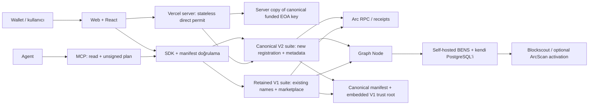
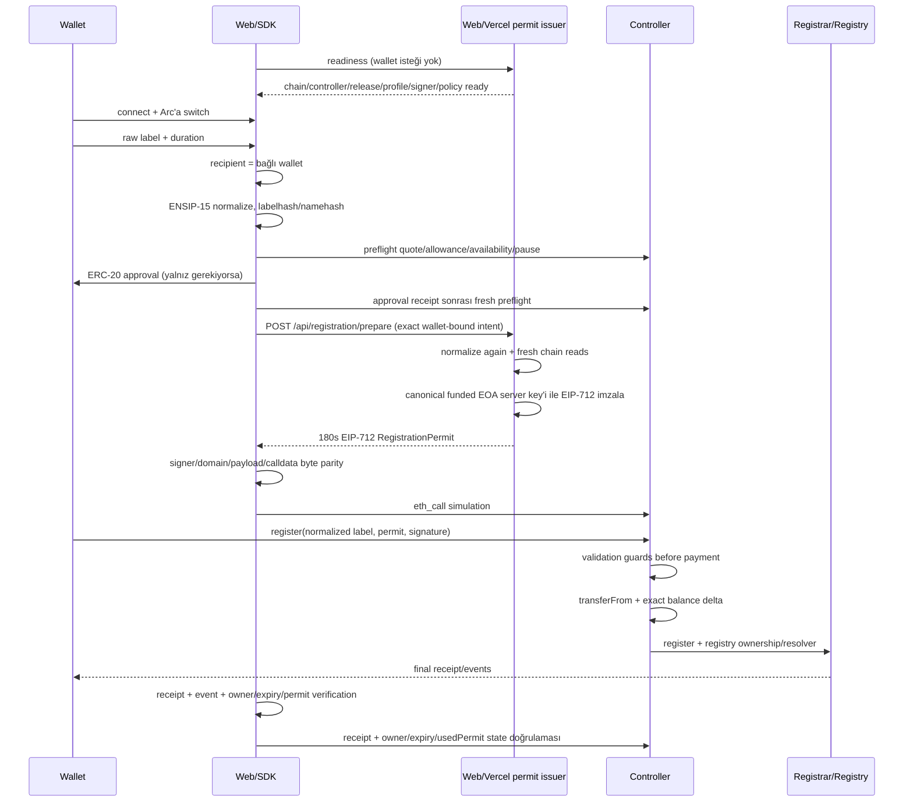

# Mimari

> **Current runtime model (24 July 2026):** new registrations and native
> ERC-721 metadata use canonical V2. Existing V1 names remain on their original
> contracts; V1 registration is paused while reads, name management and its
> marketplace/escape paths remain available. The exact two-release trust set is
> [`deployments/5042002.json`](../deployments/5042002.json) plus its
> digest-bound [`deployments/5042002.legacy.json`](../deployments/5042002.legacy.json)
> snapshot. Public capability state is also exposed at `/status`.

> Aşağıdaki staged/private-candidate anlatımı V2 production geçişinin güncel
> release-engineering yoludur. Candidate URL'si geçici olarak bütün ingress'te Basic Auth
> kullanır; final canonical public uygulama passwordless'tır. `configured + paused`
> ifadeleri yalnız ilgili rollout fazının capability durumunu anlatır.

## Sistem görünümü



Wallet, SDK ve MCP kritik state'i manifestteki hedeflerle Arc RPC üzerinden okur.
Her read ve unsigned mutation planı release ID taşır; aynı token ID iki registrar arasında
global kimlik sayılmaz. Yeni kayıt issuer'ı yalnız canonical V2'yi hedefler ve hem V2 hem
retained V1 üzerinde label availability doğrulanmadan permit üretmez. V1 kullanıcı işlemi
hiçbir zaman sessizce V2'ye yönlendirilmez.
Manifest parser'ı yapısal bütünlüğü, promotion doğrulayıcısı runtime/receipt/wiring/role
ve policy parity'sini kontrol eder; `productLive` ise fonlu E2E + operasyon kanıtı
eklenmeden public yüzeyleri açmaz. Graph Node/BENS/Blockscout arama ve discovery sağlar;
sahipliği belirleyemez. x402 keeper ilk release'te kapalıdır ve core akışın dışında
ayrı bir trust boundary'dir.

## Katmanlar ve sorumluluklar

| Katman | Sorumluluk | Güven varsayımı |
| --- | --- | --- |
| Arc kontratları | ownership, expiry, resolver state, ödeme liabilities | Tek on-chain truth |
| Manifest | chain/release/address/ABI/capability discovery | Hash ve state doğrulanmadan execution yok |
| Normalization paketi | canonical label, labelhash/namehash/tokenId | Exact version + corpus pin |
| Web/Vercel permit issuer | exact wallet-bound intent, fresh Arc checks ve EIP-712 permit | Sansür/liveness yetkisi; exclusive reservation sağlamaz |
| Tek testnet EOA + signer registry | deploy/owner/treasury/permit authenticity | Aynı funded key; basit operasyon, geniş compromise blast radius |
| Web/SDK/React | chain guard, plan ve kullanıcı işlemleri | Private key wallet'ta kalır |
| MCP | public read ve unsigned plan | İmzalama/broadcast yasak |
| Graph Node/BENS | query-optimized read model | Stale/yanlış olabilir; truth değildir |
| x402 keeper | gelecekte ödeme + execution orchestration | Release 1'de disabled/fail-closed |

## On-chain topoloji

Her iki ürün suite'i de no-proxy'dir. İsimler implementation sınıf adlarıdır; marka
iddiası değildir. Canonical V2 adresleri yalnız
[`deployments/5042002.json`](../deployments/5042002.json), retained V1 adresleri yalnız
[`deployments/5042002.legacy.json`](../deployments/5042002.legacy.json) kaydından alınır.
UI, SDK ve MCP environment değişkeninden alternatif kontrat adresi kabul etmez.

| Bileşen | Ana state/invariant | Release davranışı |
| --- | --- | --- |
| `ArcNameRegistry` | `owner`, `resolver`, `ttl`; ENS registry event parity | V2 yeni isimler; V1 mevcut isimler kendi registry'sinde kalır |
| `ArcBaseRegistrarV2` / `ArcBaseRegistrar` | ERC-721 owner, expiry, 90-day grace, registry sync | V2 ayrıca ERC-721 Metadata ve exact HTTPS `tokenURI` sunar |
| `ArcRegistrarController` | permit, quote, USDC exact-delta, referral accounting | Issuer yalnız V2 için yeni permit üretir; V1 registration paused |
| `ArcPublicResolver` | addr, multicoin addr, text, name, contenthash | Her işlem explicit release ID ile doğru resolver'a gider |
| `ArcReverseRegistrar` | address reverse node ve primary request | Reverse read canonical-first yapılabilir; sonuç release ID taşır |
| `ArcUniversalResolver` | bounded registry/resolver/reverse reads | Her release kendi doğrulanmış resolver topolojisini kullanır |
| `ArcNameMarketplace` | fixed listing, buy, pull proceeds | V2 market açık; retained V1 market ve cancel/claim exit yolları açık kalır |

Tek testnet EOA `0x78de409a6306550882328E2a67160471368387FF` deployer, owner,
treasury ve permit signer rollerini taşır. Multisig, ikinci owner, threshold, rol ayrımı
veya managed KMS/HSM yoktur.

### Dual-release cutover invariants

- Canonical manifest `registrarVersion: "v2"` ve exact metadata base URI'yi taşır.
- `legacyReleases[]`, retained V1 release ID, verification block, yedi adres,
  deployment block ve runtime hash'i ile cutover policy'sini canonical digest'e bağlar.
- `5042002.legacy.json` immutable V1 kimlik/read snapshot'ıdır. Kesimden sonraki execution
  policy'si bu dosyanın tarihsel alanlarından değil canonical `legacyReleases[]`
  referansından okunur: V1 registrations paused, V1 marketplace unpaused.
- Yeni label, hem V2 hem V1 availability kontrolü geçmeden V2'de mint edilemez.
- V1 isimleri otomatik migrate/remint edilmez. Renew, transfer, resolver, list, buy,
  cancel, claim ve stale-listing cleanup original V1 adreslerine explicit release ID ile gider.
- Canonical veya retained manifest eksik/eşleşmiyorsa dual-release reads ve mutations
  fail-closed olur; tek release'e sessiz fallback yapılmaz.

Önceki `0xcb3130…56bf6` / `0xF7c924…FB68` Safe-owned suite retired ve superseded'dır;
canonical target veya activation evidence değildir.

## Source-of-truth matrisi

| Soru | Authoritative cevap | Authoritative olmayan |
| --- | --- | --- |
| Node owner kim? | `ArcNameRegistry.owner(node)` | BENS `Domain.owner` cache'i |
| NFT registrant kim? | `ArcBaseRegistrar.ownerOf(tokenId)` | Explorer profil kartı |
| İsim active mi? | registrar expiry/grace state | stale subgraph |
| Resolver adresi ne? | registry + resolver contract | BENS resolvedAddress cache'i |
| Primary name doğrulandı mı? | reverse result + forward `addr` eşitliği | BENS “primary” alanı |
| Fiyat ne? | controller current quote + signed permit exact amount | event veya UI cache'i |
| Payment gerçekleşti mi? | success receipt + exact contract delta/event | x402 settlement tek başına |
| Release ürün-live mı? | başarılı promotion verification + `active` + `productLive` + permit issuer readiness + [acceptance artefaktları](ACCEPTANCE_MATRIX.md) | manifest `state`, `productLive` veya deploy script output'u tek başına |

## Direct registration veri akışı



Readiness wallet bağlantısından önce çalışır. Approval gerekiyorsa güvenli sıra ilk
preflight, allowance'ı tamamlamak, receipt'ten sonra quote/availability/pause state'ini
yeniden okumak ve ancak ardından doğrudan `/api/registration/prepare` ile kısa TTL permit
üretmektir.
Wallet-bound route ve controller birlikte `requester == recipient == payer == authorizedExecutor ==
msg.sender` uygular; recipient form alanı değildir ve bağlı wallet'tan türetilir. Böylece compromised signer
başka bir allowance sahibini payer göstererek charge edemez.
Permit veya transaction receipt'i ownership garantisi değildir; success receipt,
aynı receipt'teki beklenen event'ler ve registry/registrar state'i birlikte doğrulanır.
Issuer unavailable ise wallet/payment işlemi başlatılmaz. Direct permit issuer
serverless/stateless'tir: request state'i PostgreSQL'e yazılmaz. Aynı label için yarışan
birden fazla kısa ömürlü permit üretilebilir; current nonce, `usedPermit`, availability ve
EVM atomicity nedeniyle yalnız ilk başarılı Arc transaction'ı state/ödeme oluşturur.
Direct permit ID `contour-registration-direct-permit-id/v1` domain'inde request ID,
issuance zamanı, exact fingerprint, requester ve current controller nonce'undan
deterministik türetilir; permit default 180 saniye geçerlidir. Ayrı
`/api/registration/challenge` + `/issuer/v1/permit` HMAC/`personal_sign` akışı yalnız
geriye uyumluluk içindir ve public UI, OpenAPI, hosted MCP veya funded acceptance
tarafından kullanılmaz.

## Label lifecycle

Contract lifecycle:

```text
AVAILABLE -> ACTIVE -> GRACE (90d, renewal only) -> AVAILABLE
```

Issuer'ın kalıcı lifecycle state'i yoktur. Direct permit yalnız kısa süreli bir
cryptographic envelope'dur:

```text
exact wallet-bound intent -> fresh Arc checks
       -> EIP-712 permit (default 180s)
       -> success receipt | revert/expiry
```

Direct permit bir reservation veya sahiplik belgesi değildir. Server restart ve yatay
ölçekleme request state'i kaybettirmez; doğrulama exact intent, current nonce, kısa TTL ve
EIP-712 signer policy üzerinden yapılır. Aynı label için eşzamanlı permit çıkması kabul edilen
Arc Testnet trade-off'udur. Transaction sonucu yalnız controller/registrar/registry state'i
ve receipt'le belirlenir; UI response loss durumunda tekrar issuance'dan önce chain'i okur.

Başarılı re-registration sırasında registrar node'u geçici olarak sahiplenir, public
resolver record version'ını ilerletir ve registry TTL'ini `0` yapar; sonra yeni
permit-bound resolver data'yı yazıp recipient'ı owner yapar. Bütün adımlar aynı
transaction'dadır ve herhangi biri revert ederse önceki owner/expiry/TTL ve resolver
state'i atomik korunur.

## Normalization sınırı

Raw input yalnız kullanıcı kolaylığı için leading/trailing whitespace trim'inden
sonra exact-pinned ENSIP-15'e girer. UI, issuer, SDK, fixtures ve subgraph aynı
normalized UTF-8 bytes'ı kullanır. Contract tam Unicode tablo implementasyonu iddia
etmez; signed profile hash, label bytes/hash/namehash ve bounded length parity'sini
doğrular.

ASCII `.` ve ENS ayraç eşdeğerleri `。`, `．`, `｡` single-label sınırında reddedilir.
Pipeline normalization sonrası nokta kontrolünü tekrarlar; contract ve subgraph da aynı
dört ayraç için savunma-derinliği guard'ı uygular.

Fiyat normalized Unicode code point sayısına göre hesaplanır; byte uzunluğu fiyat
katmanı değildir. Token ID `uint256(labelhash(normalizedLabel))`'dır.

Kaynaklar: [ENSIP-15](https://docs.ens.domains/ensip/15/) ve
[ENS name processing](https://docs.ens.domains/resolution/names/).

## USDC ve accounting

Arc native ve ERC-20 interface'leri tek balance'ı temsil eder. Protokolün bütün
ekonomik state'i 6-decimal ERC-20 base unit'tir:

```text
controller balance >= referral liabilities
marketplace balance >= seller proceeds liabilities
withdrawable surplus = balance - liabilities
```

Native transfer ERC-20-visible bakiyeyi etkileyebildiğinden treasury hiçbir zaman
tam contract bakiyesini “beklenmeyen native” diye sweep edemez. Çekim yalnız hesaplı
surplus üzerinden yapılır. Event indexer dual stream'i dedupe eder; ayrıntılı resmi
doküman çelişkisi [ARC_DOCS_EVIDENCE.md](ARC_DOCS_EVIDENCE.md) içindedir.

## Resolver ve reverse

Resolver capability manifestte granular boolean olarak yayımlanır. Interface
uygulanmadan `supportsInterface` true dönemez. Universal resolver ismi CCIP-Read veya
ENS'in tüm universal resolver davranışını ima etmez; yalnız belgelenen bounded reads'i
sağlar.

Reverse node `<lowercase-hex-address>.addr.reverse` biçimindedir. Effective primary:

```text
reverse(account) = name
AND forward(name) = account
AND name lifecycle = ACTIVE
```

Forward confirmation yoksa UI sonucu unverified reverse hint olarak gösterebilir,
identity olarak gösteremez.

## Read-model hattı

Graph Node event'leri exact deployment block'larından replay eder. Controller'ın
plaintext normalized name event'i hash placeholder'ı önler. Subgraph owner ve
registrant kavramlarını ayırır; expiry değerine 90 günlük grace uygulaması contract
ve mapping fixture'ında aynı olmalıdır.

Self-hosted BENS önce health/sync/parity kanıtı üretir. Manifestteki BENS boolean'ları
runtime probe değildir; schema ayrı health/parity alanları taşıyana kadar sonuçlar
operatörün [acceptance artefaktlarında](ACCEPTANCE_MATRIX.md) saklanır. Hosted ArcScan
görünürlüğü operator-controlled ayrı bir capability'dir. Detaylar
[BLOCKSCOUT_BENS.md](BLOCKSCOUT_BENS.md) içindedir.

## Manifest ve activation state

`deployments/5042002.json` dört state kullanır:

```text
draft -> configured -> verified -> active
```

- `draft`: ürün kontrat adresleri null; execution fail-closed.
- `configured`: yedi adres/tx/block ve release ID atomik girilmiş; public execution kapalı.
- `verified`: runtime/source/ABI ile deployment, wiring, governance, treasury, signer ve
  release artefaktları structurally complete; promotion verifier çalıştırılabilir.
- `active`: server signer/stateless issuer readiness ve ilgili on-chain policy ile operasyonel
  execution'a izin veren state. `productLive:false`, execution'ı kendiliğinden private yapmaz;
  yalnız evidence-complete/product-live promotion iddiasının henüz sağlanmadığını belirtir.

Canonical V2 ancak clean deployment receipt'leri, 7/7 ArcScan source/ABI doğrulaması,
constructor-argument parity'si, positive `verifiedAtBlock`, funded E2E, operations drill
ve bağımsız reviewer evidence'i aynı release digest'ine bağlanınca `productLive:true`
olabilir. Retained V1 bu promotion'ın alternatifi değildir; immutable contract identity'si
canonical `legacyReleases[]` içine bağlanan ikinci readable release'tir.
Receipt koruma, evidence index ve hash politikası
[`EVIDENCE_POLICY.md`](EVIDENCE_POLICY.md) içindedir.

Parser adres/block/tx/runtime-hash bütünlüğünü, immutable URL/hash çiftlerini, canonical
Arc config'i ve policy alanlarını fail-closed kontrol eder. `pnpm verify:promotion`, yedi
rol için bağımsız contract runtime hash map'ini zorunlu tutar. Arc chain/block, creation
receipt, evidence/latest runtime code, contract wiring, tek EOA owner/treasury/signer
parity'si, boş `pendingOwner`, controller/market policy ve aktif issuer health parity'sini
canlı okur. Registrar'ın tüm `ControllerChanged` geçmişi replay edilir;
canonical controller dışında geçmişte dahi enable edilmiş adres release'i durdurur.

Artefakt fetch'i yalnız credential içermeyen operator-allowlisted HTTPS hostlarına,
public DNS resolution, redirect reddi, timeout ve streaming body cap ile yapılır.
Public-live `fundedEndToEnd` ve `operationsDrill` JSON'ları, artefakt URL/hash'lerini
blank eden non-circular promotion-subject digest'ine bağlı signed `PASS` envelope
olmalıdır; envelope ayrıca immutable ayrıntılı run raporunun URL/hash çiftini imzalar ve
recovered reviewer bağımsız allowlist'te bulunur. Doğrulayıcı run raporunu yeniden
fetch/hash eder, zorunlu işlem/assertion kapsamını ve receipt block/from/to/başarı bağlarını
Arc RPC'den denetler. Koşuyu kendisi üretmez; üretim sözleşmesi
[Acceptance ve Release Kanıt Matrisi](ACCEPTANCE_MATRIX.md) kapsamındadır.

Run'lar başlamadan önce fully-open candidate'tan `promotionTargetIntent` üretilir. Bu
yayımlanamaz schema `1.0.0` projection candidate digest'i, target verified block'u,
product-live execution digest'i ve promotion subject'i bağlar; deployment manifest değildir
ve live-only artifact URL/hash placeholder'ı taşımaz. Funded ve operations runner aynı
`--target-intent` girdisini kullanır. Funded ve operations detailed PASS raporları schema
`1.0.0`'dır. Operations broadcast dört canonical pause/unpause receipt'ini ve readiness
kapanma/geri gelme assertion'larını exact target'a bağladıktan sonra doğrudan PASS üretir.

Bu runner PASS'i pause/readiness kapsamıyla sınırlıdır. 24 saatlik throwaway signer
activation/rotation/revoke, clean-redeploy ve encrypted/offline key-recovery kanıtları bugün
eksiktir; G90/G99 `BLOCKED` kalır ve eksikken signed operations envelope public-live kanıtı
olamaz.

BENS, hosted ArcScan, MCP, ERC-8004 ve x402 aynı state'e otomatik bağlanmaz; ayrı
capability flag'leridir. Özellikle x402 ve EIP-3009 release 1'de false kalır. Public
read/register/market; canonical manifest `active`, ilgili policy unpaused,
`permitIssuer.active == true` ve readiness parity başarılı olduğunda operasyonel sayılır.
`activationEvidence.productLive == true` ve ilgili acceptance artefaktları ise ayrı
product-live/evidence-complete iddiası için zorunludur.
Private adayda web ve issuer aynı server-only `PRIVATE_CANDIDATE_MODE=true` opt-in'ini
ister; production-target deployment'ın `/`, statik asset, `/status`, API ve
`/evidence/**` dahil bütün ingress'i Basic Auth uygular. Anonymous erişim
`401 + WWW-Authenticate + no-store`, bozuk configuration `503` döndürür; başarılı auth
sonrasında `Authorization` ve client-supplied internal header'lar downstream'e taşınmaz.
Candidate `--prod --skip-domain` ile benzersiz deployment URL'sinde kalır ve canonical
public alias'ı alamaz.

Manifestin hash-pinned V2 kanıtları candidate kurulmadan önce hâlâ public canonical hosta
güvenli V1/evidence-only deployment ile yayımlanır. Candidate hostta `/evidence/**`
istisnası açılmaz ve promotion verifier evidence fetch'ine Basic credential göndermez.
Public-live build ve issuer exact
`PRODUCT_LIVE_RELEASE=<releaseId>:<manifestSha256>:<verifiedAtBlock>` binding'ini ister;
candidate credential'ları bulunamaz ve `PRIVATE_CANDIDATE_MODE=false` bile kalıntı olarak
fail-closed reddedilir. Manifest ve environment candidate'tan farklı olduğu için final
public-live ayrı build/deployment'tır; private candidate artifact'i promote edilmez.
Uygulama doğrulanmış bir client identity mekanizması implement etmediğinden
client-supplied internal header'lar hiçbir zaman authentication kanıtı sayılmaz.

Aktivasyon sırası fail-closed'dur: önce V1 inventory, açık listing/liability ve yedi runtime
identity'si pinned snapshot'a alınır; ardından paused V2 ArcScan source/ABI snapshot'ları ve
diğer evidence güvenli public canonical V1/evidence-only deployment'ta immutable URL/hash +
bağımsız trust root'larla bağlanıp `verified` gate'i geçirilir. Signer secret injection,
signature recovery, direct-intent tamper/expiry ve throwaway fork/release üzerinde 24 saatlik
signer activation/revoke drill'lerinden sonra private staged
`active + productLive:false` manifestle issuer/web candidate production target'a
`--skip-domain` ile başlatılır; pause yüzünden readiness `503` kalır. Kesimde önce yalnız V1
registration pause edilir ve exact cutover block'ta legacy policy/inventory yeniden
doğrulanır. Sonra tek owner EOA ile V2 controller unpause, readiness ve fonlu registration
smoke; yalnız PASS sonrasında ayrı transaction ile V2 marketplace unpause yapılır. V1
marketplace ile cancel/claim exit yolları kesim boyunca açık kalır. Active aday acceptance'ı
yalnız alias almayan candidate deployment'ında sürer; en son fonlu E2E + aynı target intent'e
bağlı operations drill +
signer/redeploy/offline-recovery
kanıtları + bağımsız reviewer imzası ile candidate credential'ları temizlenmiş ayrı
public-live build/deployment canonical alias'a alınabilir.
Unpause veya servis rollout'u yarıda kalırsa V2 issuance kapalı tutulur, V2 controller ve
market yeniden pause edilir; V1 market/escape işlemleri kendi incident'i yoksa açık ve
receipt/proceeds reconciliation erişilebilir bırakılır. Başarılı eski
registration veya ownership geri alınmaya çalışılmaz. Yarım deployment'ta canonical
manifest değişmez; receipt/nonce karşılaştırmasıyla güvenli resume mümkün değilse yeni
release ID ile baştan deploy edilir.

## Operasyon sınırları

- Tek operational RPC endpoint'i `https://rpc.testnet.arc.network` HTTPS adresidir;
  WebSocket transportu kapalıdır ve başka RPC fallback host'u yoktur. Normal web/operator
  HTTP profili process-local 2.100 ms pacing ve yalnız `-32011`/HTTP `429` için en fazla üç
  deneme kullanır. Uzun, salt-okunur promotion audit'i 6.000 ms pacing, en fazla altı
  rate-limit denemesi ve 18.000 ms cap'li backoff ile konservatif istisnadır. İki profil de
  Viem nested retry'ını kapatır ve Vercel instance'ları arasında global değildir.
- Uygun contract read grupları 25 ms Multicall penceresinde birleştirilir. Web readiness
  yalnız in-flight identical read'leri coalesce eder; settled readiness cache'i tutmaz.
- Browser env yalnız public site ve canonical HTTPS Arc RPC bilgisini içerir;
  WebSocket/WalletConnect runtime configuration bulunmaz.
- Tek deployer/owner/treasury/permit-signer EOA private key'i, challenge HMAC secret ve
  keeper config server-only'dir. EOA key'i permit imzalama için Vercel Sensitive
  server environment'ında tutulur. Key browser, public environment, log veya evidence'e
  giremez. Bu bilinçli
  testnet sadeleştirmesi server compromise'ının tam admin compromise'ı olacağı anlamına gelir.
- Registration body'lerindeki raw label, wallet challenge, signature veya full
  payment authorization uygulama/analytics loglarına girmemelidir. Public
  `/name/[label]` lookup path'i ise edge'e ulaşmadan önce uygulama tarafından gizlenemez;
  CDN/reverse-proxy access log'u path segmentini redact/hash etmeli veya bu route için
  path logging'i kapatmalıdır.
- Web registration POST body'leri 16 KiB ile sınırlıdır. Challenge/preflight/verify
  işleri process-local sekiz, prepare dört no-queue admission slotuna sahiptir; dolu
  instance `503`/`Retry-After` döner. Bu kontrol dağıtık/global rate limit değildir.
- Direct prepare exact request ID/origin/chain/controller/release/profile/requester/intent
  fingerprint'ini current nonce ve kısa TTL permit'e bağlar; label/policy/quote/allowance/
  availability state'ini fresh okur. Compatibility-only challenge route'u ayrıca canonical
  HMAC envelope, expiry ve wallet signature doğrular. Browser'ın gönderdiği forwarding
  header güven sınırı değildir.
- Issuer body cap'i 16 KiB ve request deadline'ı bounded'dır. Her EIP-712 imzası local
  recovery ile canonical/on-chain signer'a karşı doğrulanır. Process-local admission
  global rate limit değildir; Vercel Firewall/edge policy ayrıca uygulanır.
- `/status` public health özetini footer ve geliştirici dokümanından sunar. `/admin`
  `noindex` kalır; navigasyon bağlantısı yalnız bağlı configured governance wallet için
  görünür. Overview, bounded activity ve Controls yalnız connected wallet canlı
  governance/owner/pending-owner rollerinden birine sahipse açılır. Owner yazmaları server
  key'i kullanmaz: wallet
  simulation + imza, canonical runtime/release kontrolü, exact receipt/calldata/value
  readback ve taze action-specific post-state doğrulaması zorunludur. Receipt sonrasında
  RPC kesilirse session recovery aynı hash'i doğrular; yeni transaction otomatik tekrarlanmaz.
  Arbitrary registry rewiring ve immutable release değişiklikleri audited recovery/promotion
  tooling sınırında kalır; browser hiçbir private key veya issuer secret'ı taşımaz.
- Chain ID, controller, release ID, policy version ve normalization hash her signed
  veya cached artefakta bağlanır.
- Deployment, signer rotation, pause ve BENS version değişikliği evidence + rollback
  planı olmadan yapılmaz.

## Uygulama fazları

1. Spec, threat model, trademark/suffix ve exact dependency pinleri.
2. Contract suite ve invariants.
3. Stateless permit issuer, canonical funded EOA signer ve direct registration funded E2E.
4. Web/SDK/React/manifest/developer surfaces.
5. Marketplace.
6. Self-hosted subgraph/BENS ve optional explorer handoff.
7. MCP ve optional ERC-8004 display.
8. Ayrı future release: EIP-3009 ve x402 compensation/settlement.
9. Source verification, browser matrix, soak ve release evidence.

Bir fazın acceptance kanıtı olmadan sonraki fazın varlığı önceki fazı “complete”
yapmaz.
