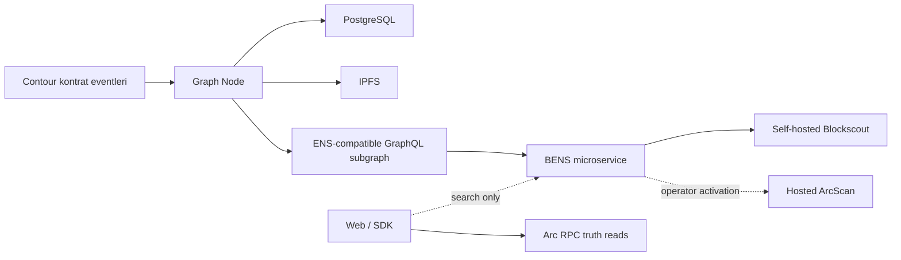

# Blockscout BENS Entegrasyonu

> Strateji: **self-host-first**.  
> Durum: core contract suite `active`, fakat BENS protokolü yapılandırılmadı, subgraph
> sync/parity kanıtı ve hosted ArcScan aktivasyonu yok. Bütün BENS capability flag'leri
> false kalır. Yedi kontrat ArcScan'de source-verified'dır; bu, BENS veya hosted name
> search aktivasyonu anlamına gelmez.

## BENS'in rolü

BENS arama ve explorer display için bir read model'dir. Registry ownership, registrar
NFT owner/expiry veya resolver state için source of truth değildir.



ArcScan bizim kontrolümüzde değildir. dApp deploy'u veya self-hosted BENS health'i
hosted ArcScan name search'ünü otomatik aktif yapmaz.

Resmî rehber: [Blockscout ENS/BENS name-service integration](https://docs.blockscout.com/setup/microservices/blockscout-ens-bens-name-service-integration).

## Aktivasyon durumları

Manifest üç bağımsız durumu ayırır:

| Durum | Anlamı | Şu an |
| --- | --- | --- |
| `protocolConfigured` | BENS config + protocol + subgraph URL tanımlı | `false` |
| `subgraphSynced` | exact-block replay tamam, fatal error yok, head yakın | `false` |
| `hostedArcscanActive` | ArcScan operator search/display'ı canlı fixture ile doğrulandı | `false` |

Bu manifest boolean'ları runtime probe değildir; operatörün config/sync/hosted
activation iddiasıdır. Mevcut schema `selfHostedBensHealthy`,
`selfHostedBlockscoutHealthy` veya `parityVerifiedAtBlock` alanlarını taşımaz. Schema
version'ı bu alanları açıkça destekleyene kadar ad-hoc key eklenmez; health response,
head/lag, pinned-block parity ve timestamp ayrı immutable
[acceptance artefaktlarında](ACCEPTANCE_MATRIX.md) tutulur. Bir artefaktın başarılı
olması diğerini ima etmez ve manifest flag'i tek başına health kanıtı sayılmaz.

## Contract/event gereksinimleri

BENS/BNS örnek mapping'leri human-readable label'ı event'ten kaydeder. Controller:

```solidity
event NameRegistered(
    string name,
    bytes32 indexed label,
    address indexed owner,
    uint256 baseCost,
    uint256 premium,
    uint256 expires
);

event NameRenewed(
    string name,
    bytes32 indexed label,
    uint256 cost,
    uint256 expires
);
```

yayınlar. `name`, `label` ve token ID aynı exact-pinned normalized UTF-8 bytes'tan
üretilir. `premium` v1'de `0` olabilir. Protocol fiyat truth'u event değildir;
controller quote/state ve on-chain payment sonucudur.

Single-label preimage ASCII `.` ile `。`, `．`, `｡` ayraçlarını reddeder ve canonical
normalization corpus hash'ini pinler. Re-registration sırasında resolver
`VersionChanged` ile eski record version'ını, registry `NewTTL(..., 0)` ile eski custom
TTL'i atomik geçersiz kılar; subgraph her iki event'i de derived state'e uygular.

Mevcut resmî BNS örnek mapping'i altı alanlı registration event'ini tüketir:

- [Controller mapping](https://raw.githubusercontent.com/blockscout/blockscout-rs/main/blockscout-ens/graph-node/subgraphs/bns-subgraph/src/BASERegistrarController.ts)
- [Base registrar mapping](https://raw.githubusercontent.com/blockscout/blockscout-rs/main/blockscout-ens/graph-node/subgraphs/bns-subgraph/src/BaseRegistrarImplementation.ts)
- [BNS subgraph manifest](https://raw.githubusercontent.com/blockscout/blockscout-rs/main/blockscout-ens/graph-node/subgraphs/bns-subgraph/subgraph.yaml)

Hazır base mapping `GRACE_PERIOD_SECONDS = 7776000` kullanır. Contour contract grace
değeri de 90 gün (`7_776_000` saniye) olduğundan bu sabit mapping fixture'ıyla
eşleşmelidir. Her iki tarafta explicit test yapılır; upstream mapping kopyasına
güvenmek tek başına kanıt değildir.

## Zorunlu GraphQL veri modeli

Resmî schema:
[ENS subgraph schema.graphql](https://raw.githubusercontent.com/blockscout/blockscout-rs/main/blockscout-ens/graph-node/subgraphs/ens-subgraph/schema.graphql).

En az şu ayrımlar korunur:

| Alan | Kaynak/semantik |
| --- | --- |
| `Domain.id` | full namehash |
| `Domain.name` | full normalized `<label>.contour` |
| `Domain.labelName` | normalized single label |
| `Domain.labelhash` | `keccak256(normalized UTF-8 label)` |
| `Domain.owner` | registry node owner |
| `Domain.registrant` | registrar ERC-721 owner |
| `Domain.resolvedAddress` | resolver forward address cache'i |
| `Domain.expiryDate` | registrar expiry + mapping'in beklediği lifecycle semantiği |
| `Domain.tokenId` | `uint256(labelhash)` |
| `Registration.cost` | controller event cost, 6-decimal base unit |

`Domain`, `Registration`, `Account`, `Resolver`, `DomainEvent`,
`RegistrationEvent` ve `ResolverEvent` entity'leri korunur. `owner` ve `registrant`
aynı alan gibi birleştirilemez. Transfer, expiry ve registry sync fixture'larında
geçici farklar açıkça ele alınır.

## Human-readable preimage

Subgraph yalnız labelhash görürse BENS sonucu `[91be3f...].contour` gibi placeholder
kalabilir. Controller event'indeki normalized plaintext label mapping içinde
`maybeSaveDomainName()` eşdeğeriyle kaydedilir. Rainbow table birincil çözüm değildir.

Resmî BNS utility yalnız name preimage saklar ve tam ENSIP-15 doğrulaması yapmaz:
[BNS utils](https://raw.githubusercontent.com/blockscout/blockscout-rs/main/blockscout-ens/graph-node/subgraphs/bns-subgraph/src/utils.ts).
Bu nedenle normalization güvenliği upstream mapping'e devredilemez; contract event
parity ve canonical corpus mapping testleri zorunludur.

## Subgraph manifesti

Her data source gerçek deployment transaction'ından alınan pozitif block ile başlar:

```yaml
network: arc-testnet
dataSources:
  - name: Registry
    source:
      address: ${REGISTRY_ADDRESS}
      startBlock: ${REGISTRY_BLOCK}      # configured: 52155004; 0 yasak
  - name: BaseRegistrar
    source:
      address: ${BASE_REGISTRAR_ADDRESS}
      startBlock: ${BASE_REGISTRAR_BLOCK}
  - name: Controller
    source:
      address: ${CONTROLLER_ADDRESS}
      startBlock: ${CONTROLLER_BLOCK}
  - name: PublicResolver
    source:
      address: ${PUBLIC_RESOLVER_ADDRESS}
      startBlock: ${PUBLIC_RESOLVER_BLOCK}
```

Configured source değerleri:

| Data source | Adres | Start block |
| --- | --- | --- |
| Registry | `0xdD69B92f6fAE6da3825b7d126Fe058e78E7F8482` | canonical manifestteki positive deployment block |
| BaseRegistrar | `0x0DF136b94f99CAfcC010723b51f8D8EC10A0B907` | canonical manifestteki positive deployment block |
| Controller | `0xFbA7618c929075728b82c69B0B2A8C8d98e4B6A3` | canonical manifestteki positive deployment block |
| PublicResolver | `0x3Ea097FFc2089a5Ae24DF46F18d621D007577f5C` | canonical manifestteki positive deployment block |

Bu değerlerin bilinmesi deploy edilebilir BENS yüzeyi oluşturmaz. ArcScan source
verification tamamlanmıştır; ABI snapshot'larının verifier-compatible immutable
publication'ı, mapping fixtures, promotion gate, Graph Node replay ve parity kanıtı
ayrıca gerekir.

Template generation, dynamic resolver discovery veya static resolver seçimi source
verification sonrası sabitlenir. ABI dosyası deployment manifestte URL + SHA-256 ile
eşleşir. Full replay aynı exact block'tan tekrar üretilebilir olmalıdır.

Activated `subgraph.yaml` renderer'ı yalnız adres/block alanlarını okumaz: exact
promotion attestation'ı manifest digest'ine karşı doğrular ve live-verified,
`productLive:true` release olmadan render etmeyi reddeder. Mevcut manifest `active`
adres/block ve public ArcScan source/ABI URL/hash çiftleri taşır; fakat `productLive:false`,
BENS capability flag'leri false ve funded/operations product-live evidence'i eksiktir. Bu yüzden
activated renderer'ın reddetmesi beklenen fail-closed davranıştır; address-less
compile-only scaffold BENS'in çalıştığı iddiası değildir.

## BENS protocol config

BENS'in güncel config şekli resmî `blockscout-rs` config'inden pinlenir:

- [BENS server README](https://raw.githubusercontent.com/blockscout/blockscout-rs/main/blockscout-ens/bens-server/README.md)
- [Production config example](https://raw.githubusercontent.com/blockscout/blockscout-rs/main/blockscout-ens/bens-server/config/prod.json)

Configured adreslerle, bütün BENS gate'leri geçtikten sonra üretilecek hedef yapı:

```json
{
  "subgraphs_reader": {
    "networks": {
      "5042002": {
        "blockscout": { "url": "https://testnet.arcscan.app" },
        "use_protocols": ["contour"],
        "rpc_url": "https://rpc.testnet.arc.network"
      }
    },
    "protocols": {
      "contour": {
        "tld_list": ["contour"],
        "network_id": 5042002,
        "subgraph_name": "contour-arc-testnet",
        "address_resolve_technique": "reverse_registry",
        "specific": {
          "type": "ens_like",
          "native_token_contract": "0x0DF136b94f99CAfcC010723b51f8D8EC10A0B907",
          "registry_contract": "0xdD69B92f6fAE6da3825b7d126Fe058e78E7F8482"
        }
      }
    }
  }
}
```

`native_token_contract` burada Arc USDC değildir. BENS terminolojisinde registrar
ERC-721 kontratıdır; `registry_contract` registry adresidir. Yukarıdaki configured
adresler canonical manifestten gelir. Config dosyası yine üretilmez/servise verilmez;
`bens.protocolConfigured` ancak immutable image/config, subgraph endpoint ve operator
evidence'i hazır olduğunda kontrollü olarak true yapılır.

Server environment:

```env
BENS__CONFIG=/config/contour-arc-testnet.json
BENS__DATABASE__CONNECT__URL=postgresql://...
BENS__DATABASE__RUN_MIGRATIONS=true
BENS__SERVER__HTTP__ADDR=0.0.0.0:8050
BENS__SERVER__HTTP__ENABLED=true
BENS__SUBGRAPHS_READER__REFRESH_CACHE_DISABLED=false
```

Self-hosted Blockscout backend:

```env
MICROSERVICE_BENS_ENABLED=true
MICROSERVICE_BENS_URL=https://<bens-host>
```

Frontend:

```env
NEXT_PUBLIC_NAME_SERVICE_API_HOST=https://<bens-host>
```

Kaynaklar:

- [Blockscout backend integration env](https://docs.blockscout.com/setup/env-variables/backend-envs-integrations)
- [Blockscout frontend common env](https://docs.blockscout.com/setup/env-variables/frontend-common-envs/envs)

## Version ve supply-chain policy

- Graph Node, IPFS, PostgreSQL, BENS ve Blockscout sürümü/digest'i release manifestte
  pinlenir.
- `latest` container tag yasaktır.
- Image signature/SBOM veya en az registry digest + source tag evidence'i tutulur.
- Schema/mapping fork commit SHA'sı ve local patch diff'i release'e bağlanır.
- Migration staging backup/restore testi olmadan production-like data üzerinde koşmaz.
- Upstream “minimum v6” ifadesi güncel sürüm seçimi değildir; seçilen sürüm ayrıca
  compatibility ve security review'dan geçer.

## Reverse ve “primary” semantiği

BENS FAQ'daki primary davranışı ilk oluşturulan, süresi dolmamış ismi seçebilir; bu
ENS forward-confirmed reverse kimliğiyle aynı değildir. UI ve agent identity:

```text
BENS reverse candidate
  -> direct Arc reverse read
  -> direct forward addr read
  -> lifecycle ACTIVE check
  -> verified primary
```

adımlarını uygular. BENS sonucu tek başına verified badge veremez.

## Hosted ArcScan handoff

Self-hosted acceptance tamamlandıktan sonra operator/upstream paketi hazırlanır:

- chain ID, RPC ve `.contour` protocol config;
- registry/base/controller/resolver adresleri + exact start blocks;
- source-verified explorer linkleri;
- subgraph endpoint, sync/fatal-error evidence;
- BENS health/domain/address/batch fixture output'ları;
- name→address ve address→name parity örnekleri;
- version/digest ve operator contact/runbook.

ArcScan tarafında configuration PR veya operator onayı alınmadan
`hostedArcscanActive` false kalır. Hosted aktivasyon gerçekleşmezse self-hosted BENS
ürün discovery'si olarak kullanılabilir; resmî ArcScan yalnız tx/contract linki olur.

Contour kontratları source-verified'dır; her adres için
`https://testnet.arcscan.app/api/v2/smart-contracts/{address}` API cevabı source ve ABI
döndürür. Operator handoff yine bu response'ların immutable URL/hash paketini ve diğer
BENS kanıtlarını ister; yalnız adres veya transaction sayfası bu maddeyi karşılamaz.
Publication ve checksum kuralları
[`EVIDENCE_POLICY.md`](EVIDENCE_POLICY.md)'de tanımlanır.

## Acceptance gate

Aktif BENS iddiası için:

- subgraph codegen/build/mapping tests başarılı;
- exact deployment block'tan full replay başarılı;
- head lag threshold içinde, fatal error yok;
- register/renew/transfer/resolver/text/reverse fixtures doğru;
- re-registration `VersionChanged` + TTL reset fixture'ı ve dört dot-separator negatif
  corpus fixture'ı doğru;
- namehash/labelhash/tokenId/name preimage parity doğru;
- contract, web, subgraph expiry/grace değerleri aynı;
- owner ve registrant ayrımı doğru;
- hash placeholder yok;
- BENS health, domain, address, lookup ve batch endpoint'leri çalışıyor;
- pinned block'ta direct RPC sonucu ile BENS sonucu karşılaştırılmış;
- expired isim verified primary değil;
- backup/restore, migration rollback, health kontrolü ve operator runbook denenmiş

olmalıdır. Hosted ArcScan gate'i bunlara ek canlı ArcScan search fixture'ı gerektirir.
