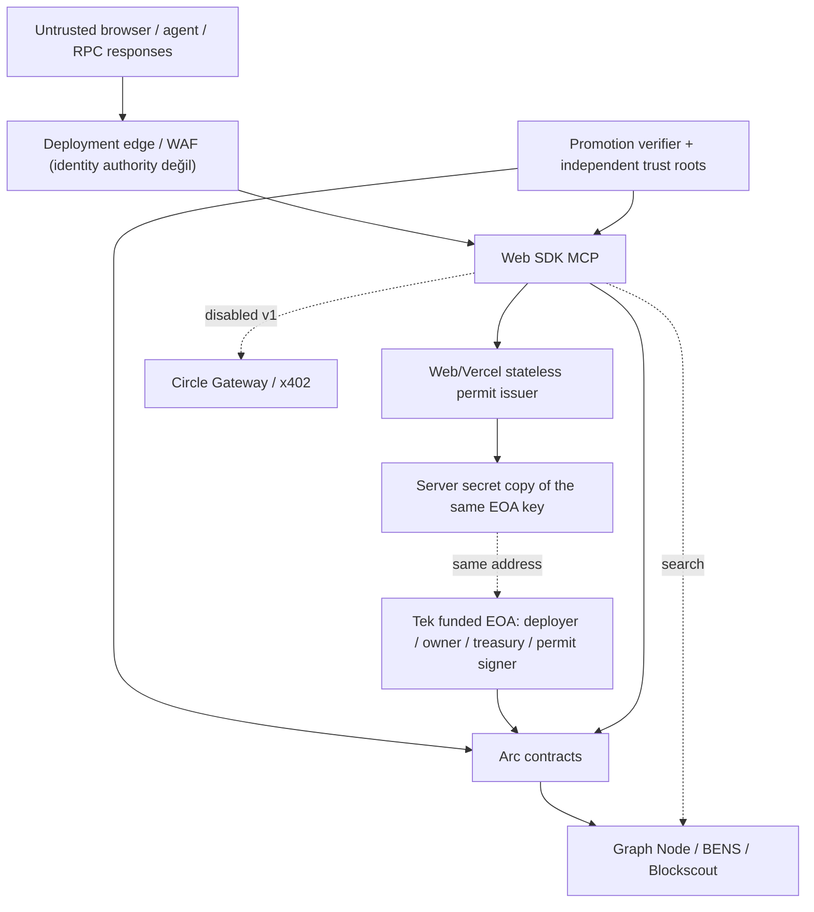

# Tehdit Modeli

> Kapsam: Contour Name Protocol'ün Arc Testnet ilk release'i.  
> Bu belge preventive controls ve release gate'lerini tanımlar; audit sonucu değildir.

Canonical public UI, OpenAPI, hosted MCP ve funded acceptance akışı tek adımda
`POST /api/registration/prepare` kullanır; wallet `personal_sign` challenge'ı istemez.
`/api/registration/challenge` ile devamındaki HMAC/`personal_sign` doğrulamaları yalnız
geriye uyumluluk yüzeyidir. Compatibility route'un güvenlik kontrolleri korunur ancak
`REGISTRATION_CHALLENGE_SECRET` canonical issuer readiness'inin önkoşulu değildir.

## Güvenlik hedefleri

1. Bir `.contour` ismi yalnız geçerli permit'in bağladığı recipient adına kaydolur;
   wallet-bound aktif yolda `requester == recipient == payer == authorizedExecutor ==
   msg.sender` eşitliği bozulamaz.
2. Aynı permit, quote veya payment birden fazla değer transferine/registration'a yol
   açamaz.
3. Registry/registrar/resolver on-chain state'i tek ownership truth olarak kalır.
4. Referral ve marketplace liabilities her zaman contract bakiyesinden küçüktür veya
   eşittir; yalnız surplus çekilebilir.
5. Arc native/ERC-20 shared-USDC modeli duplicate accounting veya sweep loss yaratmaz.
6. Normalized name, hashes, token ID, fiyat, event ve BENS preimage birebir eşleşir.
7. Signer compromise hızlı revoke edilebilir; signer ekleme gecikmesiz ele geçirilemez.
8. Read-only/MCP/agent yüzeyleri execution authority kazanamaz.
9. Kanıtlanmamış x402/EIP-3009/BENS/ArcScan capability'leri fail-closed kalır.
10. Manifestteki self-asserted hash veya PASS alanı tek başına public-live release
    üretemez; bağımsız trust root, reviewer imzası, attestation ve doğrulanmış deployment
    ingress/WAF policy'si gerekir.

## Korunan varlıklar

- name ownership, expiry ve resolver records;
- short-lived permit yarışlarının ödeme/state atomicity'si;
- tek funded deployer/owner/treasury/permit-signer EOA;
- kullanıcı USDC'si, referral credits, seller proceeds ve treasury surplus;
- deployment manifest, release ID, promotion attestation/subject, bağımsız reviewer ve
  ABI/contract code-hash trust root'ları, normalization corpus;
- compatibility-only stateless challenge HMAC secret'i ve aynı EOA key'inin server-only
  permit-signer kopyası;
- compatibility-only wallet challenges/signatures ve gelecekteki payment authorizations;
- BENS search integrity ve verified reverse display;
- operator credentials, deployer keystore ve Vercel secret erişimi.

## Aktörler

- normal kullanıcı, referrer, seller ve buyer;
- wallet provider veya smart wallet;
- public mempool observer/sniper;
- kötü niyetli label/Unicode girdisi gönderen;
- compromised frontend/RPC/indexer/BENS;
- compromised web/permit issuer veya tek EOA server secret'i;
- kötü niyetli/buggy token, resolver callback veya marketplace recipient;
- agent/MCP client ve gelecekte x402 payer/keeper;
- Blockscout/ArcScan operator ve supply-chain sağlayıcıları;
- release reviewer/CI operatorü ve deployment edge/WAF sağlayıcısı.

## Trust boundary'ler



Her boundary'de chain, release, contract, hash, freshness ve identity yeniden
doğrulanır. TLS veya aynı organization içinde olmak payload güveni sağlamaz.

Core permit issuer'ın stateless olması yalnız registration boundary'sine aittir. BENS/
Graph Node kendi ayrı PostgreSQL veritabanı ve operatörünü; x402 ise gelecekte etkinleşirse
kendi durable order state'ini gerektirir. Bu bağımsız dependency'ler core issuer kararıyla
kaldırılmış sayılmaz.

Canonical registration boundary'sinde App → Issuer çağrısı doğrudan
`/api/registration/prepare`'dır: server fresh chain/intent state'ini doğrular ve payer-bound
EIP-712 permit üretir. Challenge HMAC'i ve wallet `personal_sign` recovery'si yalnız
compatibility route çağrıldığında Issuer boundary'sine eklenir.

## Tehdit ve kontrol matrisi

| ID | Tehdit | Etki | Ana kontroller | Release gate |
| --- | --- | --- | --- | --- |
| T01 | Calldata kopyalama/name sniping veya üçüncü-party allowance charge | Yanlış owner/fon çekimi | wallet yolda `requester=recipient=payer=authorizedExecutor=msg.sender`, party-bound EIP-712 permit, 180s TTL, no bare register | copied-calldata + compromised-signer payer/recipient fixture |
| T02 | Permit replay/cross-chain replay | Çift kayıt/ödeme | chain/controller/release/profile, permitId+nonce, usedPermit | replay matrix + wrong-domain tests |
| T03 | Issuer aynı label'a eşzamanlı permit verir | Yarış/kaybeden gas maliyeti | açık no-reservation semantiği; fresh nonce/availability/quote; usedPermit ve EVM atomic revert | same/different-wallet concurrency matrix; en fazla bir success |
| T04 | Issuer sansürü/unavailability | Liveness | açık merkezi authority beyanı, health, fail-closed, runbook | unavailable iken sıfır wallet/payment isteği |
| T05 | Tek EOA server secret compromise | Sahte permit + tam protocol/treasury takeover | server secret isolation, post-sign recovery, issuance stop, mümkünse pause/rotation; güven yoksa clean redeploy | secret-leak scan + pause/rotation/redeploy incident drill |
| T06 | Tek EOA private key kaybı/çalınması | Admin erişimi kaybı veya tam takeover | browser/log/evidence yasağı, minimum server erişimi, şifreli/offline yedek ve kurtarma testi; risk açıkça kabul edilir | funded clean-deploy + recovery/clean-redeploy drill |
| T07 | Unicode normalization/ayraç farkı | Yanlış isim/hash/fiyat | exact pin, corpus hash, post-normalization dot check; `.`, `。`, `．`, `｡` reject; golden vectors | UI/issuer/contract/subgraph parity |
| T08 | Price TOCTOU veya referral mutation | Kullanıcı fazla/az öder | expected amount/BPS/duration signed, current equality before payment | mutation negative tests |
| T09 | ERC-20 reentrancy veya non-exact transfer | State/accounting corruption | nonReentrant, guard-first order, exact balance delta, atomic revert | malicious-token fixtures |
| T10 | Shared native/ERC-20 USDC double count | Insolvency/yanlış UI | single asset model, no native sweep, 6d accounting | live shared-balance fixture |
| T11 | Dual event stream iki kez sayılır | Yanlış analytics/deposit | emitter-aware dedupe, tx/log identity, dedicated event spec | live ERC20/native event fixture |
| T12 | USDC blocklist/runtime revert | Stuck/partial state | all guards first, EVM atomicity, receipt status check, retry policy | blocklisted payer/recipient fixture |
| T13 | Registrar transfer/expiry veya re-registration registry'den sapar | Yanlış owner/stale records | transfer hook sync, resolver record-version + TTL=0 lease reset, lifecycle invariants | state-machine/re-registration invariant |
| T14 | Reverse spoof | Sahte identity | reverse + forward addr + ACTIVE check | positive/negative reverse fixtures |
| T15 | Resolver capability spoof/DoS | Yanlış records/UI crash | granular manifest, supportsInterface conformance, bounded reads | resolver conformance/fuzz |
| T16 | Marketplace stale listing | Yanlış satış | owner/lifecycle/price/fee guards, transfer invalidation | transfer-before-buy race |
| T17 | Marketplace/controller insolvency | Claim kaybı | pull payments, explicit liabilities, surplus-only withdraw | invariant + forced/native transfer |
| T18 | BENS stale/poisoned/read-model takeover | Yanlış explorer/name display | direct RPC truth reads, pinned block parity, health/sync, no ownership decision | replay/parity/lag gate |
| T19 | BENS hash placeholder veya wrong preimage | Yanlış name display | plaintext normalized event + mapping parity | no-placeholder fixture |
| T20 | Hosted ArcScan yanlış capability iddiası | Kullanıcı yanıltma | separate hosted flag, operator evidence | live ArcScan search required |
| T21 | Manifest/ABI/config/promotion poisoning | Arbitrary target/calldata veya forged live claim | all-or-nothing fields; SDK discovery'de out-of-band digest/release pin + 256 KiB cap; independent role-keyed contract hash trust roots; exact single-EOA parity; non-circular signed PASS + reviewer allowlist; exact release binding | tamper tests + signed release artefacts |
| T22 | Wallet wrong-chain/decimals metadata | Yanlış tx/amount display | viem arcTestnet pin, switch/add fixture, ERC20 units canonical | MetaMask/Rabby matrix |
| T23 | Tek canonical RPC eclipse/stale/rate-limit cevabı | Yanlış availability/receipt veya belirsiz operator sonucu | exact `.network` host, chain ID/pinned-block freshness, receipt+aynı-block state/code; normal 2.100 ms/3-attempt ve promotion-only 6.000 ms/6-attempt bounded policy; belirsizlikte no-write/manual review | stale/wrong-chain/`-32011`/429 fixture |
| T24 | Raw label veya compatibility challenge log leakage | Sniping/privacy | body redaction, hash identifiers, compatibility-only challenge/signature/HMAC redaction, `/name/*` edge path redaction, retention policy | app/analytics/CDN access-log leakage scan |
| T25 | MCP gains signing/broadcast authority | Key/fund loss | no keys, unsigned plans, target/ABI/chain validation | API capability and secret scan |
| T26 | ERC-8004 spoof/outage | Sahte agent identity/core outage | optional read-only, address+forward-confirm, fail-soft | registry error/negative identity tests |
| T27 | x402 settle/register non-atomicity | Ödeme veya service kaybı | disabled v1; future durable order, limits, compensation | funded failure+refund E2E |
| T28 | x402 duplicate/response loss | Çift ödeme/kayıt | idempotency fingerprint, reconciliation, bounded retry | crash/timeout/duplicate matrix |
| T29 | Direct EIP-3009 replay/wallet incompatibility | Fon kaybı veya failed UX | disabled v1; future authorization state + fallback tests | separate activation review |
| T30 | Dependency/container compromise | Key/data/code compromise | exact versions/digests, lockfile, SBOM, source review | reproducible build + vuln scan |
| T31 | Admin pause kullanıcı fonunu kilitler | Liveness/claim loss | pause new risk paths; cancel/claim remain open | pause escape-path tests |
| T32 | “Testnet” production algısı | Kullanıcı yanılması | testnet badge, no fiat promise, no official branding | content/legal review |
| T33 | Registration API/body/RPC/signing amplification | Memory/CPU/RPC exhaustion veya imza DoS | 16 KiB body cap, no-queue process-local admission, bounded RPC deadline, direct prepare intent/origin/requester doğrulaması; compatibility route'ta ayrıca HMAC+wallet doğrulaması ve edge/WAF rate policy | saturation + oversized/chunked body tests |
| T34 | Compatibility-only stateless challenge tamper/replay veya client-IP spoof | Yetkisiz permit/rate-limit bypass | compatibility route'ta canonical HMAC, exact origin/release/intent/expiry/requester binding ve wallet recovery; forwarding header auth sayılmaz; secret yoksa route fail-closed kalır, canonical readiness etkilenmez | HMAC bit-flip/replay/origin/path/header mutation tests |
| T35 | Browser admin stale state, yanlış calldata veya receipt timeout sonrası yeniden gönderim | Yanlış policy/recipient veya duplicate withdrawal | canlı owner/pending-owner gate, canonical runtime/release hash, typed critical confirmation, simulation sonrası ikinci state/authority read, exact from/to/input/value receipt readback, action-specific serializable post-state expectation; pending hash çözülmeden yeni write yok ve recovery hiçbir zaman transaction'ı yeniden göndermez | expectation/parser/log-limit unit tests + no-signing browser admin review |
| T35 | Candidate veya product ingress bypass | Yetkisiz acceptance/public execution | candidate Basic auth; exact `PRODUCT_LIVE_RELEASE`; client-supplied internal headers silinir ve identity sayılmaz; candidate credentials live build'de bulunmaz | build/startup + Basic-auth/header-spoof/exact-binding negatif matrisi |
| T36 | Promotion artefakt SSRF/oversized redirect | CI iç ağ erişimi veya resource exhaustion | HTTPS hostname allowlist, exclusively-public DNS, no redirect/credentials/fragments, timeout ve streaming caps | DNS/private-IP/redirect/chunked-body tests |

## Öncelikli attack trees

### İsmi saldırgan adına kaydetme

```text
Steal name
├─ copy victim calldata
│  └─ blocked by requester=recipient=payer=authorizedExecutor=msg.sender
├─ replay old permit
│  └─ blocked by release/domain/time/usedPermit
├─ obtain two permits through race
│  └─ possible by design; only first Arc success wins, loser atomically reverts
├─ compromise signer
│  └─ bounded by Vercel secret controls + post-sign recovery; aynı key admin olduğu için tam takeover riski kalır
└─ normalization confusion
   └─ exact corpus/hash parity + displayed normalized bytes
```

### Ekonomik liability'yi aşan withdrawal

```text
Drain claims
├─ treat native and ERC20 as separate balances
├─ sweep unexpected native
├─ double-count dual Transfer events
├─ reentrancy before liability update
└─ owner withdraws gross balance instead of surplus
```

Kontrol seti: native sweep yok, canonical 6-decimal ledger, direct balance invariants,
nonReentrant, pull payments ve `withdrawable = balance - liabilities`.

### Sahte verified agent/name gösterimi

```text
Fake identity
├─ stale BENS primary
├─ reverse record without forward match
├─ expired name
├─ ERC-8004 ID not controlled by resolved address
└─ poisoned manifest/RPC
```

Kontrol seti: direct RPC, ACTIVE lifecycle, reverse+forward equality, optional ERC-8004
ownership link, manifest target doğrulaması ve ayrı runtime code/role evidence artefaktı.

### Sahte public-live release üretme

```text
Forge live release
├─ manifestte kendi runtime hash'ini yayınla
│  └─ blocked by independent role-keyed contract hash trust roots
├─ eski/başka release PASS artefaktını yeniden kullan
│  └─ blocked by chain/release/promotion-subject/evidence-block binding + reviewer signature
├─ manifestte farklı owner/treasury/signer göster
│  └─ blocked by live exact funded-EOA parity checks
├─ geçici kötü controller enable edip sonra kapat
│  └─ blocked by full ControllerChanged history replay
└─ private candidate veya spoofed internal header ile public surface aç
   └─ blocked by exact PRODUCT_LIVE_RELEASE + candidate credential rejection; header identity sayılmaz
```

## Kabul edilen residual riskler

- Permit issuer sansür ve liveness authority'sidir.
- Arc Testnet ve Circle test infrastructure production SLA/finality/fund guarantee
  sağlamaz.
- 180 saniyelik aktif permit expire olana kadar risk taşır; signer aynı admin EOA olduğu
  için secret compromise'ı yalnız permit kapsamıyla sınırlı değildir.
- Tek EOA kaybı admin kontrolünü kalıcı olarak kaybettirebilir; tek EOA compromise'ı tam
  protocol ve treasury takeover'ıdır. Multisig/KMS/rol ayrımı bilinçli olarak yoktur.
- Public chain'de kayıtlar, owner ve resolver records gizli değildir.
- Self-hosted BENS arama geçici olarak stale olabilir; core truth etkilenmez.
- Wallet UI kendi chain metadata/display davranışını uygulayabilir; application
  accounting yine ERC-20 6 decimals'a sabitlenir.
- Web no-queue admission process-local'dır; çok-instance/global abuse kontrolü deployment
  ingress/WAF policy'sine bağlı kalır.
- Stateless issuer exclusive label reservation veya global idempotency sağlamaz. Aynı
  label için birden fazla kısa ömürlü permit üretilebilir; on-chain yalnız ilk successful
  transaction state/ödeme oluşturur, kaybeden kullanıcı gas harcayabilir.

Bu riskler UI ve developer docs'ta saklanamaz. Kabul edilmeyen riskler x402'nin
compensation olmadan açılması, native sweep, bare register, signer secret'in browser/
repository/log/evidence'e sızması, privileged key reuse ve BENS'in ownership truth
olmasıdır.

## Out-of-scope savunmalar

Aşağıdakiler güvenlik kontrolü sayılmaz:

- Arc block time/finality'nin mempool sniping'i tek başına çözmesi;
- gelecekteki Arc privacy roadmap'i;
- testnet tokenlarının “değersiz” olması;
- explorer/BENS ekranında doğru görünmesi;
- UI'nın yanlış calldata üretmeyeceğine güvenmek;
- beta etiketi veya kullanım koşullarının teknik compensation yerine geçmesi.

## Emergency response

Öncelik sırası:

1. yeni permit issuance ve risk artıran register/list/buy yollarını pause et;
2. compromised signer'ı immediate revoke et; yeni signer ekleme delay'ini koru;
3. cancel/claim/withdraw-user-proceeds gibi risk azaltan yolları açık tut;
4. chain receipt/state, permit zaman aralığı, varsa x402 order ve liabilities snapshot'ı al;
5. manifest capability'lerini false'a çek; kullanıcıya açık status yayınla;
6. root cause, affected permits/orders, recovery ve compensation raporu üret;
7. yeni release/policy/hash kanıtı olmadan reopen etme.

## Modeli güncelleyen değişiklikler

Şunlar yeni threat-model review gerektirir:

- suffix/brand/normalization dependency veya corpus değişikliği;
- proxy/upgradeability veya yeni admin role;
- owner/treasury/signer EOA veya custody modeli değişikliği;
- settlement asset/referral/market mechanism değişikliği;
- EIP-3009 veya x402 activation;
- ERC-8004'ün authorization'a katılması;
- hosted ArcScan/BENS veya yeni indexer trust kullanımı;
- subdomain, auction, offer veya cross-chain resolution.
